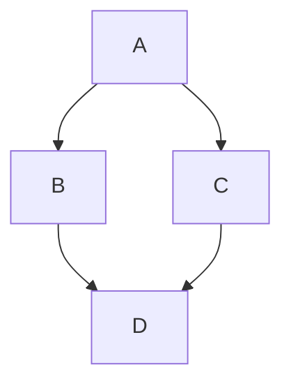
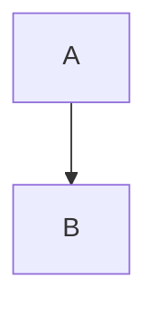

# mdbook-mermaid

A preprocessor for [mdbook][] to add [mermaid.js][] support.

This is a fork of [mdbook-mermaid by Jan-Erik Rediger](https://github.com/badboy/mdbook-mermaid).

## Fork additions

- Full-viewport diagram expansion with interactive zoom, reset controls, and a floating help card.
- Modal titles from figure captions or immediately preceding captions/headings, plus larger title and help text.
- Theme-aware diagrams, modal styling, and zoom cursors.
- Automatic installation of the modal stylesheet alongside the Mermaid JavaScript assets.
- mdBook 0.5 patch-version compatibility checks, validated with mdBook 0.5.4 and a book-build smoke test.
- Updated CI/release workflows and mise-backed Rust validation.

## Diagram rendering

[mdbook]: https://github.com/rust-lang-nursery/mdBook
[mermaid.js]: https://mermaidjs.github.io/

It turns this:

~~~

~~~

into this:


in your book.
(Graph provided by [Mermaid Live Editor](https://mermaidjs.github.io/mermaid-live-editor/#/view/eyJjb2RlIjoiZ3JhcGggVEQ7XG4gICAgQS0tPkI7XG4gICAgQS0tPkM7XG4gICAgQi0tPkQ7XG4gICAgQy0tPkQ7IiwibWVybWFpZCI6eyJ0aGVtZSI6ImRlZmF1bHQifX0))

Each diagram includes an expand icon in the upper-right corner (visible on hover) that opens the diagram in a
full-viewport modal for better readability.

The modal supports:

- Closing with the X icon button or backdrop click.
- Click-to-zoom inside the diagram.
- Shift-click to zoom out; holding Shift displays the zoom-out cursor.
- Alt-click, or Option-click on macOS, to reset zoom.
- Escape to reset zoom first, then close when already at the default zoom.

The same controls are shown in a floating help card inside the modal so users do not have to discover the gestures by
trial and error.

The modal title is intentionally conservative. It uses the first available value from:

1. A direct `<figcaption>` child when the diagram is wrapped in a `<figure>`.
2. An immediately preceding `<figcaption>` or `<caption>` element.
3. An immediately preceding heading (`<h1>` through `<h6>`).

If none of those are present, the modal title is left blank instead of guessing from arbitrary nearby content.
For diagrams that need an explicit title independent of the section heading, prefer standard HTML figure markup:

```html
<figure>
<pre class="mermaid">
flowchart TD
    A --> B
</pre>
<figcaption>Request lifecycle</figcaption>
</figure>
```

Markdown Mermaid code fences remain supported for the common case:

~~~markdown

~~~

## Installation

### From source

To install this fork from source (requires Rust 1.88 or newer):

```sh
cargo install --git https://github.com/RobertDeRose/mdbook-mermaid --locked --force mdbook-mermaid
```

This builds the fork and replaces any existing `mdbook-mermaid` executable.
The commands `cargo install mdbook-mermaid` and `cargo binstall mdbook-mermaid` install the upstream package,
not this fork's additions.

### Manually

Check this fork's [Releases page](https://github.com/RobertDeRose/mdbook-mermaid/releases) for pre-built binaries.
If a release is available for your system, download and unpack it, then move the `mdbook-mermaid` executable
into `$HOME/.cargo/bin`.

## Configure your mdBook to use `mdbook-mermaid`

When adding `mdbook-mermaid` for the first time, let it add the required files and configuration:

```
mdbook-mermaid install path/to/your/book
```

This will add the following configuration to your `book.toml`:

```toml
[preprocessor.mermaid]
command = "mdbook-mermaid"

[output.html]
additional-js = ["mermaid.min.js", "mermaid-init.js"]
additional-css = ["mermaid-modal.css"]
```

It will skip any unnecessary changes and detect if `mdbook-mermaid` was already configured.
When upgrading from upstream or an earlier fork version, rerun this command to refresh the bundled assets
and add `mermaid-modal.css` to your configuration.

Additionally it copies the files `mermaid.min.js`, `mermaid-init.js`, and `mermaid-modal.css` into your book's directory.
You find these files in the [`src/bin/assets`](src/bin/assets) directory.
You can modify `mermaid-init.js` to configure Mermaid, see the [Mermaid documentation] for all options.

[Mermaid documentation]: https://mermaid-js.github.io/mermaid/#/Setup?id=mermaidapi-configuration-defaults

Finally, build your book:

```
mdbook build path/to/book
```

## Development

Building against mdBook 0.5.4 requires Rust 1.88 or newer.

Run the tests with `cargo test --locked --all`. With mdBook 0.5.4 on your `PATH`,
also run the book-build smoke test:

```
cargo test --locked --test it -- --ignored
```

### Update the bundled mermaid.js

Find the latest version of `mermaid` on <https://github.com/mermaid-js/mermaid/releases>.
Then run:

```
cargo xtask <version>
```

This will fetch the minified mermaid.js file and commit it.

**Note:** `mdbook-mermaid` does NOT automatically update the `mermaid.min.js` file in your book. For that rerun

```
mdbook-mermaid install path/to/your/book
```

or manually replace the file.

## License

This fork remains licensed under the Mozilla Public License 2.0. See [LICENSE](LICENSE).

- Upstream work: Copyright (c) 2018-2024 Jan-Erik Rediger <janerik@fnordig.de>.
- Robert DeRose's fork contributions: Copyright (c) 2026 Robert DeRose.
- Other contributions remain copyright their respective holders.

The upstream copyright notice applies to the original work, not to new contributions made by others in this fork.
Those contributions remain owned by their respective copyright holders; contributing does not assign copyright
to the original maintainer.

Mermaid is [MIT licensed](https://github.com/mermaid-js/mermaid/blob/develop/LICENSE).
The bundled `mermaid.min.js` retains its MIT license; `mermaid-init.js` and `mermaid-modal.css` are MPL-2.0 licensed.
