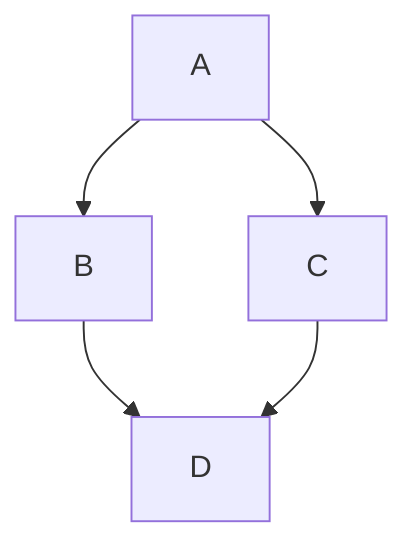
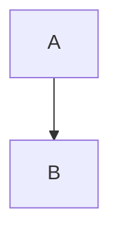

# mdbook-mermaid

A preprocessor for [mdbook][] to add [mermaid.js][] support.

[mdbook]: https://github.com/rust-lang-nursery/mdBook
[mermaid.js]: https://mermaidjs.github.io/

It turns this:

~~~

~~~

into this:


in your book.
(Graph provided by [Mermaid Live Editor](https://mermaidjs.github.io/mermaid-live-editor/#/view/eyJjb2RlIjoiZ3JhcGggVEQ7XG4gICAgQS0tPkI7XG4gICAgQS0tPkM7XG4gICAgQi0tPkQ7XG4gICAgQy0tPkQ7IiwibWVybWFpZCI6eyJ0aGVtZSI6ImRlZmF1bHQifX0))

Each diagram includes an expand icon in the upper-right corner (visible on hover) that opens the diagram in a
full-viewport modal for better readability.

The modal supports:

- Closing with the X icon button, backdrop click, or Escape.
- Click-to-zoom inside the diagram.
- Shift-click or Shift-hold to zoom out.
- Alt-click, or Option-click on macOS, to reset zoom.
- Escape to reset zoom first, then close when already at the default zoom.

The same controls are shown in a floating help card inside the modal so users do not have to discover the gestures by
trial and error.

The modal title is intentionally conservative. It uses the first available value from:

1. A direct `<figcaption>` child when the diagram is wrapped in a `<figure>`.
2. An immediately preceding `<figcaption>` or `<caption>` element.
3. An immediately preceding heading (`<h1>` through `<h6>`).

If none of those are present, the modal title is left blank instead of guessing from arbitrary nearby content.
For diagrams that need an explicit title independent of the section heading, prefer standard HTML figure markup:

```html
<figure>
<pre class="mermaid">
flowchart TD
    A --> B
</pre>
<figcaption>Request lifecycle</figcaption>
</figure>
```

Markdown Mermaid code fences remain supported for the common case:

~~~markdown

~~~

## Installation

### From source

To install it from source:

```
cargo install mdbook-mermaid
```

This will build `mdbook-mermaid` from source.

### Using `cargo-binstall`

If you have [cargo-binstall](https://github.com/cargo-bins/cargo-binstall) already:

```
cargo binstall mdbook-mermaid
```

This will download and install the pre-built binary for your system.

### Manually

Binary releases are available on the [Releases page](https://github.com/badboy/mdbook-mermaid/releases).
Download the relevant package for your system, unpack it, and move the `mdbook-mermaid` executable into `$HOME/.cargo/bin`:

## Configure your mdBook to use `mdbook-mermaid`

When adding `mdbook-mermaid` for the first time, let it add the required files and configuration:

```
mdbook-mermaid install path/to/your/book
```

This will add the following configuration to your `book.toml`:

```toml
[preprocessor.mermaid]
command = "mdbook-mermaid"

[output.html]
additional-js = ["mermaid.min.js", "mermaid-init.js"]
additional-css = ["mermaid-modal.css"]
```

It will skip any unnecessary changes and detect if `mdbook-mermaid` was already configured.

Additionally it copies the files `mermaid.min.js`, `mermaid-init.js`, and `mermaid-modal.css` into your book's directory.
You find these files in the [`src/bin/assets`](src/bin/assets) directory.
You can modify `mermaid-init.js` to configure Mermaid, see the [Mermaid documentation] for all options.

[Mermaid documentation]: https://mermaid-js.github.io/mermaid/#/Setup?id=mermaidapi-configuration-defaults

Finally, build your book:

```
mdbook path/to/book
```

## Development

### Update the bundled mermaid.js

Find the latest version of `mermaid` on <https://github.com/mermaid-js/mermaid/releases>.
Then run:

```
cargo xtask <version>
```

This will fetch the minified mermaid.js file and commit it.

**Note:** `mdbook-mermaid` does NOT automatically update the `mermaid.min.js` file in your book. For that rerun

```
mdbook-mermaid install path/to/your/book
```

or manually replace the file.

## License

MPL. See [LICENSE](LICENSE).
Copyright (c) 2018-2024 Jan-Erik Rediger <janerik@fnordig.de>

Mermaid is [MIT licensed](https://github.com/knsv/mermaid/blob/master/LICENSE).
The bundled assets (`mermaid.min.js`) are MIT licensed.
